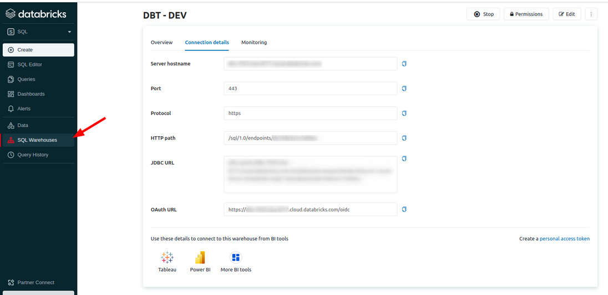
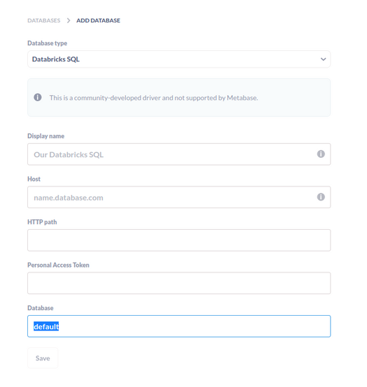

# Metabase Driver: Databricks SQL Warehouse

## Installation

Beginning with Metabase 0.32, drivers must be stored in a `plugins` directory in the same directory where `metabase.jar` is, or you can specify the directory by setting the environment variable `MB_PLUGINS_DIR`. There are a few options to get up and running with a custom driver.

## Build

In order to build it locally, you're gonna need [metabase](https://github.com/metabase/metabase) project to build this project, so make sure you clone it in a parent directory. 

```
make build
```

## Run Locally

```
docker pull metabase/metabase:latest

make run
```
Once the Metabase startup completes, you can access your Metabase at `localhost:3000`.

## Usage

Copy `host`, `http-path` and your `personal-access-token` to metabase form.




